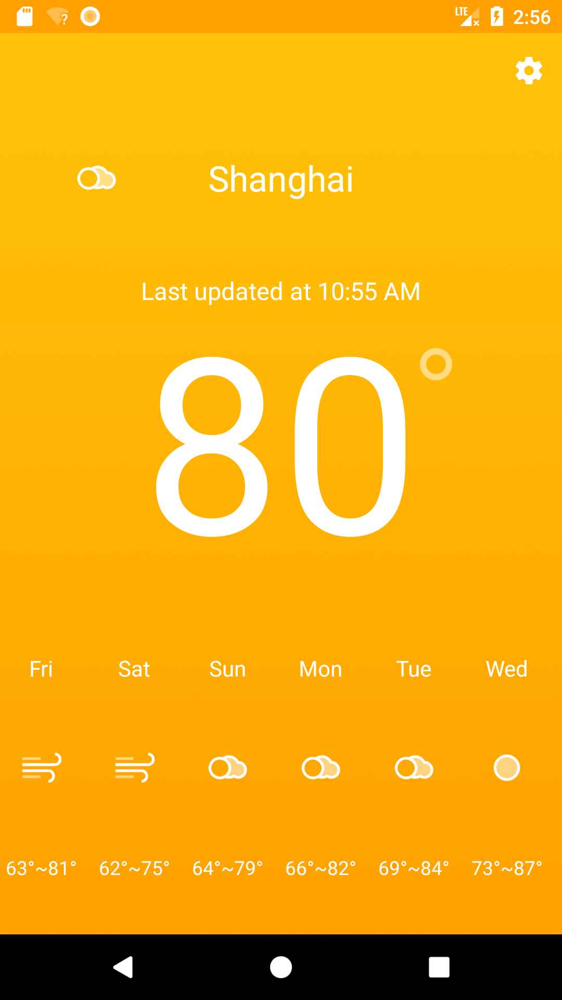

# SimpleWeather
This is a project I build to practic MVP architecture

## ScreenShots

### Features
* get the current weather condition and daily forecast based on the user's current location
* more features will be added in the future...

### Known Bugs
* fail to get the user's current locatioin

### Contribution
This is the first project I start to applay MVP pattern, so There may be some implemation problems.
Any issue would be welcomed.
